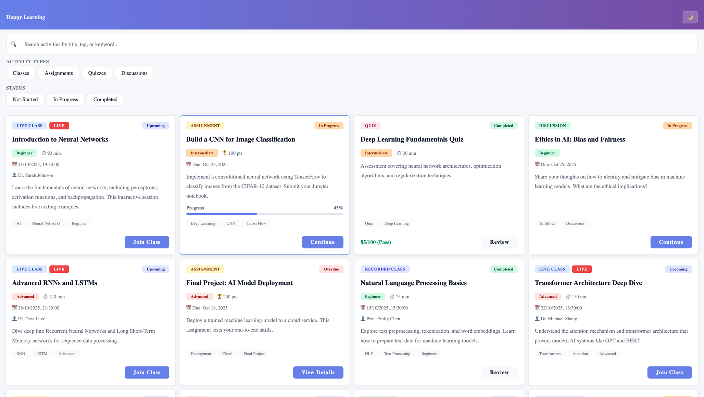
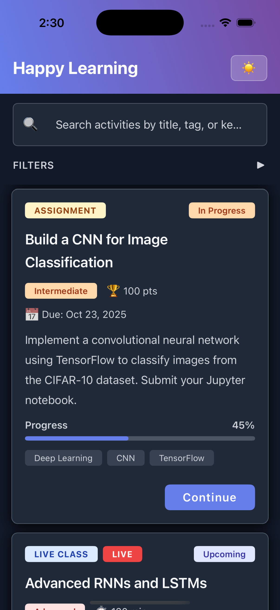

# Learning Platform - Activity Listing App

A cross-platform learning platform built with React Native and React, enabling learners to view, filter, and manage their learning activities across web and mobile devices.

## 📱 Screenshots

### Web Application




### Mobile Application

<div style="display: flex; gap: 20px;">
  
  
</div>

## ✨ Features

- **Comprehensive Activity Listing** - View all learning activities including live/recorded classes, assignments, quizzes, and discussions
- **Smart Filtering** - Filter by activity type and status to quickly find what you need
- **Search Functionality** - Search activities by title or description
- **Light & Dark Mode** - Full theme support with seamless switching
- **Responsive Design** - Works perfectly on desktop, tablet, and mobile devices
- **Cross-Platform** - Single codebase runs on web and native (iOS/Android)

## 🛠️ Tech Stack

### Monorepo Management

- **[Turborepo](https://turbo.build/)** - High-performance build system for JavaScript/TypeScript monorepos

### Frontend Frameworks

- **[React](https://react.dev/)** - Web application framework
- **[React Native](https://reactnative.dev/)** - Mobile application framework
- **[Expo](https://expo.dev/)** - React Native development platform

### UI Library

- **[Tamagui](https://tamagui.dev/)** - Universal UI library for React Native and Web
  - Provides consistent styling across platforms
  - Excellent performance with compile-time optimization
  - Built-in theme support

### State Management

- **[Zustand](https://github.com/pmndrs/zustand)** - Lightweight state management
  - Theme state management
  - Counter store (example)

### Build Tools

- **[Vite](https://vitejs.dev/)** - Fast web development build tool
- **[Metro](https://metrobundler.dev/)** - React Native bundler
- **[TypeScript](https://www.typescriptlang.org/)** - Type safety across the codebase

### Testing

- **[Vitest](https://vitest.dev/)** - Fast unit testing for web
- **[Jest](https://jestjs.io/)** - Testing framework for mobile
- **[React Testing Library](https://testing-library.com/react)** - Component testing

### Code Quality

- **[ESLint](https://eslint.org/)** - JavaScript/TypeScript linting
- **[Prettier](https://prettier.io/)** - Code formatting
- Pre-configured rules for consistent code style across the project

## 📋 Prerequisites

- **Node.js**: >= 18.0.0
- **Yarn**: >= 1.22.0 (or npm >= 8.0.0)
- **iOS Development** (for iOS builds):
  - macOS
  - Xcode >= 14.0

## 🚀 Installation

1. **Clone the repository**

   ```bash
   git clone <repository-url>
   cd learning-platform
   ```

2. **Install dependencies**

   ```bash
   yarn install
   ```

   This will install all dependencies for the monorepo including web, mobile, and shared packages.

## 💻 Running the Applications

### Web Application

1. **Development mode**

   ```bash
   yarn workspace web dev
   ```

   The app will be available at `http://localhost:5173`

2. **Build for production**
   ```bash
   yarn workspace web build
   ```

### Mobile Application

1. **Start the Expo development server**

   ```bash
   yarn workspace mobile start
   ```

2. **Run on iOS Simulator** (macOS only)
   ```bash
   yarn workspace mobile ios
   ```
3. **Run on physical device**
   - Install the [Expo Go](https://expo.dev/client) app on your iOS or Android device
   - Scan the QR code shown in the terminal after running `yarn workspace mobile start`

### Run All Apps

To start both web and mobile in development mode:

```bash
yarn dev
```

## 📦 Project Structure

```
learning-platform/
├── apps/
│   ├── web/                 # Vite + React web application
│   │   ├── src/
│   │   │   ├── components/
│   │   │   ├── App.tsx
│   │   │   └── main.tsx
│   │   └── vite.config.ts
│   └── mobile/              # Expo + React Native application
│       ├── src/
│       │   ├── components/
│       │   └── App.tsx
│       └── app.json         # Expo configuration (app name, version, icons, splash screen, etc.)
├── packages/
│   └── shared/              # Shared code, components, and logic
│       ├── src/
│       │   ├── data/        # Mock data
│       │   ├── stores/      # Zustand stores
│       │   ├── types/       # TypeScript types
│       │   ├── ui/          # Shared UI components
│       │   │   ├── components/
│       │   │   ├── theme/
│       │   │   └── ThemeProvider.tsx
│       │   └── storage/     # Platform-specific storage
│       └── package.json
├── turbo.json               # Turborepo configuration
└── package.json             # Root package.json
```

## 🎯 Tech Choices & Tradeoffs

| Technology | Why I Chose It                                      | Pros ✅ | Tradeoffs ⚠️                                                                                                                                                                  |
|------------|-----------------------------------------------------|---------|-------------------------------------------------------------------------------------------------------------------------------------------------------------------------------|
| **[Turborepo](https://turbo.build/)** | High-performance monorepo management                | • Fast, incremental builds with intelligent caching<br>• Parallel task execution across workspaces<br>• Easy to manage multiple apps and packages<br>• Scales well as the monorepo grows | • Additional complexity for smaller projects<br>• Learning curve for team members unfamiliar with monorepos                                                                   |
| **[Tamagui](https://tamagui.dev/)** | Universal UI library for cross-platform consistency | • True cross-platform UI components (web & native)<br>• Excellent performance with compile-time optimizations<br>• Built-in theme system with dark mode support<br>• Type-safe styling with TypeScript<br>• Smaller bundle sizes compared to alternatives | • Smaller ecosystem compared to Material-UI<br>• Less community resources and examples<br>• Some advanced customizations require deeper understanding                         |
| **[Zustand](https://github.com/pmndrs/zustand)** | Lightweight state management                        | • Minimal boilerplate compared to Redux<br>• Small bundle size (~1KB)<br>• Simple API that's easy to learn<br>• No Context Provider wrapper needed<br>• Works seamlessly across React and React Native | • Less middleware and tooling compared to Redux<br>• Smaller ecosystem for advanced use cases <br> • Seleced over Context API and Redux purely with the intention of learning |
| **[Vite](https://vitejs.dev/)** | Fast modern build tool for web                      | • Lightning-fast HMR (Hot Module Replacement)<br>• Modern build tool optimized for development experience<br>• Built-in TypeScript support<br>• Excellent plugin ecosystem | • Newer than webpack, may have less community solutions for edge cases                                                                                                        |
| **[Expo](https://expo.dev/)** | React Native development platform                   | • Simplified setup and development workflow<br>• Over-the-air updates<br>• Easy device testing with Expo Go<br>• Great tooling and documentation | • Larger app bundle size<br>• Some native modules require custom dev clients                                                                                                  |

## 🧑‍💻 Development

### Code Quality

The project is configured with **ESLint** and **Prettier** to maintain consistent code quality and formatting across all packages.

**Available Commands:**

```bash
# Lint all packages
yarn lint

# Format code with Prettier
yarn format

# Fix auto-fixable linting issues
yarn lint:fix
```

### Adding New Dependencies

```bash
# Add to specific workspace
yarn workspace web add <package-name>
yarn workspace mobile add <package-name>
yarn workspace @learning-platform/shared add <package-name>

# Add to root
yarn add -W <package-name>
```
